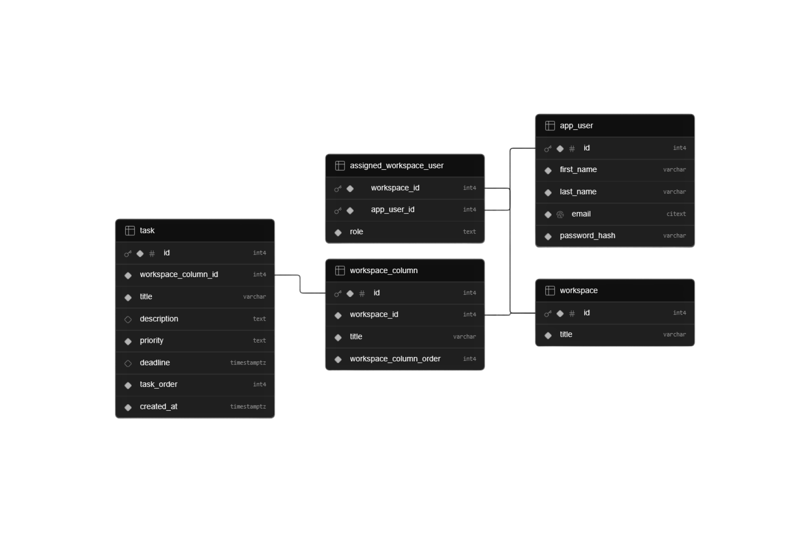

# Flowspace Backend

Flowspace is a collaborative workspace and task management API built for a productivity app with kanban boards.

The matching frontend lives here: [frontend repository](https://github.com/RobinHawiz/flowspace-frontend).

## Table of Contents

- [Features](#features)
- [Project Status](#project-status)
- [Tech Stack](#tech-stack)
- [Architecture](#architecture)
- [Data Model](#data-model)
- [API Overview](#api-overview)
- [Realtime Events](#realtime-events)
- [Running Locally](#running-locally)
- [Scripts](#scripts)

## Features

- **Cookie authentication:** users can register, log in, log out, and fetch their authenticated user profile through a JWT stored in an HTTP only cookie.
- **Workspace management:** authenticated users can create, update, delete, and fetch workspaces they have access to.
- **Workspace membership:** workspaces support admin/member roles, member lookup, adding members by email, and removing members from a workspace.
- **Kanban board structure:** each workspace can contain ordered columns, and each column can contain ordered tasks.
- **Task management:** tasks can be created, updated, deleted, reordered within a column, and moved between columns.
- **Database enforced permissions:** the backend checks workspace membership and admin roles before returning or modifying workspaces, members, columns, and tasks.
- **Realtime workspace updates:** Socket.IO broadcasts authenticated updates when workspaces are created, updated, deleted, or when members are added/removed. Column and task mutations return through HTTP responses only until planned realtime support is added.

## Project Status

The project is currently a pre v1 release. The core REST API is in place, and realtime updates are implemented for workspace and membership changes. Before marking the project as v1, the main missing piece is realtime support for column and task changes.

Planned for v1:

- Realtime updates for column creation, updates, deletion, and reordering.
- Realtime updates for task creation, updates, deletion, reordering, and moving between columns.

Planned for v2:

- Notification center for surfacing workspace events users should be notified about in real time and keeping a history of past notifications.
- Lexicographic indexing for column and task ordering so reorder operations no longer need to reindex other rows.

## Tech Stack

- **Runtime:** Node.js
- **Language:** TypeScript
- **HTTP framework:** Fastify
- **Realtime:** Socket.IO
- **Database:** PostgreSQL
- **Authentication:** JWT stored in an HTTP only cookie
- **Dependency injection:** Awilix
- **Validation:** Fastify/AJV JSON schemas
- **Password hashing:** bcrypt
- **Logging:** Pino / pino-pretty in development
- **Deployment:** Azure App Service with GitHub Actions

## Architecture

The backend separates technical responsibilities through layers, while each layer is organized by domain responsibility. In this project, a domain represents one area of functionality within the larger system, such as authentication, workspaces, workspace columns, or tasks. Each domain has matching route, controller, service, repository, model, and schema files. This keeps the codebase easy to trace from an HTTP endpoint down to the SQL query that reads or changes data.

The request path looks like this:

```text
Route -> Controller -> Service -> Repository -> PostgreSQL
```

Request handling is split into the following layers:

- **Routes** define HTTP endpoints and attach validation/auth hooks.
- **Controllers** translate Fastify requests into service calls and HTTP responses.
- **Services** enforce workspace rules and permission checks.
- **Repositories** execute PostgreSQL read/write queries.
- **Models and schemas** define TypeScript data types and Fastify/AJV validation schemas.

Project structure:

```text
src/
├── app.ts             # Fastify app setup and plugin/route registration
├── server.ts          # Server entrypoint and startup checks
├── config/            # CORS, PostgreSQL pool, DI container, Socket.IO setup
├── controllers/       # HTTP request/response handling
├── services/          # Business rules and permission checks
├── repositories/      # PostgreSQL read/write queries
├── routes/            # Fastify route definitions and validation hooks
├── models/            # TypeScript types for entities, requests, and responses
├── schemas/           # Fastify/AJV request validation schemas
├── realtime/          # Socket.IO publisher and subscriber classes
├── hooks/             # Request hooks, including JWT authentication
├── errors/            # Custom app error and validation error classes
└── types/             # Fastify and Socket.IO type augmentation

db/
├── createDb.sql       # Database creation SQL used by install-db
└── schema.sql         # Schema setup SQL used by install-db
```

## Data Model

PostgreSQL stores IDs as integers so the database can use generated identity columns. Outside the database boundary, IDs are treated as strings in API responses, route params, JWT payloads, and socket events. This keeps one ID type across the backend and frontend because route params already arrive as strings, and using strings everywhere avoids repeated number/string conversions that can cause equality checks and cache updates to fail. Repository queries handle the conversion when reading from or writing to PostgreSQL.

The schema below shows how users, workspaces, columns, and tasks are related:



### Column and Task Ordering

Columns and tasks use integer indexing for ordering. Each column or task gets a unique order value within its parent, and lower numbers appear first. When an item is inserted, moved, or deleted, the backend updates its order value and reindexes the surrounding columns or tasks so the order starts at `0` and has no gaps.

With items `I1`, `I2`, `I3`, and so on, that looks like this:

```text
Before insertion:
Item:   [I1]    [I2]    [I3]    [I4]    [I5]
Index:   0       1       2       3       4

After inserting I6 between I2 and I3:
Item:   [I1]    [I2]    [I6]    [I3]    [I4]    [I5]
Index:   0       1       2       3       4       5
```

Pros:

- Simple to implement and easy to reason about.
- Works well with database sorting through `ORDER BY`.
- Makes frontend ordering straightforward because array positions also start at `0` and have no gaps.

Cons:

- Inserts, moves, and deletes may require surrounding rows to be reindexed.
- Reindexing can become a performance bottleneck as columns or task lists grow.

> [!NOTE]
> Lexicographic indexing is planned as a future improvement so column and task reorder operations no longer need to reindex other rows.

Core tables:

### `app_user`

Stores registered users. Email uses `citext` so uniqueness is case insensitive.

```sql
CREATE TABLE app_user (
  id INT PRIMARY KEY GENERATED ALWAYS AS IDENTITY,
  first_name VARCHAR(50) NOT NULL,
  last_name VARCHAR(50) NOT NULL,
  email CITEXT UNIQUE NOT NULL CHECK (
    email ~* '^[A-Za-z0-9._+%-]+@[A-Za-z0-9.-]+[.][A-Za-z]+$'
  ),
  password_hash VARCHAR(200) NOT NULL
);
```

### `workspace`

Stores the main collaborative workspace.

```sql
CREATE TABLE workspace (
  id INT PRIMARY KEY GENERATED ALWAYS AS IDENTITY,
  title VARCHAR(100) NOT NULL
);
```

### `assigned_workspace_user`

Connects users to workspaces and stores their role.

```sql
CREATE TABLE assigned_workspace_user (
  workspace_id INT NOT NULL,
  app_user_id INT NOT NULL,
  role TEXT NOT NULL CHECK (role IN ('admin', 'member')),
  PRIMARY KEY (workspace_id, app_user_id),
  FOREIGN KEY (workspace_id) REFERENCES workspace(id) ON DELETE CASCADE,
  FOREIGN KEY (app_user_id) REFERENCES app_user(id) ON DELETE CASCADE
);

CREATE UNIQUE INDEX idx_workspace_role
ON assigned_workspace_user (workspace_id, role)
WHERE role = 'admin';
```

> [!NOTE]
> `idx_workspace_role` is a partial unique index that only applies to rows where `role = 'admin'`. This allows a workspace to have many members, but only one admin.

### `workspace_column`

Stores ordered kanban columns inside a workspace.

```sql
CREATE TABLE workspace_column (
  id INT PRIMARY KEY GENERATED ALWAYS AS IDENTITY,
  workspace_id INT NOT NULL,
  title VARCHAR(200) NOT NULL,
  workspace_column_order INT NOT NULL CHECK (workspace_column_order >= 0),
  FOREIGN KEY (workspace_id) REFERENCES workspace(id) ON DELETE CASCADE,
  CONSTRAINT unique_workspace_column_order
    UNIQUE (workspace_id, workspace_column_order)
    DEFERRABLE INITIALLY DEFERRED
);
```

> [!NOTE]
> `unique_workspace_column_order` prevents two columns in the same workspace from having the same order. The constraint is deferrable, so PostgreSQL checks it at transaction commit instead of after each individual row update. This allows reorder operations to temporarily produce duplicate order values while the transaction is still running.

### `task`

Stores ordered tasks inside workspace columns.

```sql
CREATE TABLE task (
  id INT PRIMARY KEY GENERATED ALWAYS AS IDENTITY,
  workspace_column_id INT NOT NULL,
  title VARCHAR(200) NOT NULL,
  description TEXT,
  priority TEXT NOT NULL CHECK (priority IN ('low', 'medium', 'high')),
  deadline TIMESTAMPTZ,
  task_order INT NOT NULL CHECK (task_order >= 0),
  created_at TIMESTAMPTZ NOT NULL DEFAULT NOW(),
  FOREIGN KEY (workspace_column_id) REFERENCES workspace_column(id) ON DELETE CASCADE,
  CONSTRAINT unique_task_order
    UNIQUE (workspace_column_id, task_order)
    DEFERRABLE INITIALLY DEFERRED
);
```

> [!NOTE]
> `unique_task_order` prevents two tasks in the same column from having the same order. The constraint is deferrable, so PostgreSQL checks it at transaction commit instead of after each individual row update. This allows reorder and move operations to temporarily produce duplicate order values while the transaction is still running.

## API Overview

All protected routes require the `token` cookie set by `POST /api/auth/login`.

IDs in route params are sent as strings. Workspace mutation requests can optionally include an `x-client-request-id` header so the frontend can ignore realtime events caused by its own HTTP request.

### Auth

| Method | Endpoint             | Body                                                                                                            | Response                                                                   |
| ------ | -------------------- | --------------------------------------------------------------------------------------------------------------- | -------------------------------------------------------------------------- |
| `POST` | `/api/auth/register` | `{ firstName: string (1 to 50), lastName: string (1 to 50), email: email string, password: string (8 to 200) }` | `201` `{ id: string, firstName: string, lastName: string, email: string }` |
| `POST` | `/api/auth/login`    | `{ email: email string, password: string (8 to 200) }`                                                          | `200` sets `token` cookie and returns `{ success: true }`                  |
| `POST` | `/api/auth/logout`   | none                                                                                                            | `200` clears `token` cookie and returns `{ success: true }`                |
| `GET`  | `/api/auth/me`       | none                                                                                                            | `200` `{ id: string, firstName: string, lastName: string, email: string }` |

### Workspaces

| Method   | Endpoint                       | Params                | Body                           | Response                                                           |
| -------- | ------------------------------ | --------------------- | ------------------------------ | ------------------------------------------------------------------ |
| `GET`    | `/api/workspaces`              | none                  | none                           | `200` `[{ id: string, title: string, role: "admin" \| "member" }]` |
| `GET`    | `/api/workspaces/:workspaceId` | `workspaceId: string` | none                           | `200` `{ id: string, title: string, role: "admin" \| "member" }`   |
| `POST`   | `/api/workspaces`              | none                  | `{ title: string (1 to 100) }` | `201` `{ id: string, title: string, role: "admin" }`               |
| `PATCH`  | `/api/workspaces/:workspaceId` | `workspaceId: string` | `{ title: string (1 to 100) }` | `204` no body                                                      |
| `DELETE` | `/api/workspaces/:workspaceId` | `workspaceId: string` | none                           | `204` no body                                                      |

### Workspace Members

| Method   | Endpoint                                          | Params                                   | Body                      | Response                                                                                                |
| -------- | ------------------------------------------------- | ---------------------------------------- | ------------------------- | ------------------------------------------------------------------------------------------------------- |
| `GET`    | `/api/workspaces/:workspaceId/members`            | `workspaceId: string`                    | none                      | `200` `[{ id: string, firstName: string, lastName: string, email: string, role: "admin" \| "member" }]` |
| `POST`   | `/api/workspaces/:workspaceId/members`            | `workspaceId: string`                    | `{ email: email string }` | `201` `{ id: string, firstName: string, lastName: string, email: string, role: "member" }`              |
| `DELETE` | `/api/workspaces/:workspaceId/members/:appUserId` | `workspaceId: string, appUserId: string` | none                      | `204` no body                                                                                           |

### Workspace Columns

| Method   | Endpoint                                                                  | Params                                           | Body                                                               | Response                                                              |
| -------- | ------------------------------------------------------------------------- | ------------------------------------------------ | ------------------------------------------------------------------ | --------------------------------------------------------------------- |
| `GET`    | `/api/workspaces/:workspaceId/workspace-columns`                          | `workspaceId: string`                            | none                                                               | `200` `[{ id: string, title: string, workspaceColumnOrder: number }]` |
| `POST`   | `/api/workspaces/:workspaceId/workspace-columns`                          | `workspaceId: string`                            | `{ title: string (1 to 200), workspaceColumnOrder: integer >= 0 }` | `201` `{ id: string, title: string, workspaceColumnOrder: number }`   |
| `PATCH`  | `/api/workspaces/:workspaceId/workspace-columns/:workspaceColumnId/title` | `workspaceId: string, workspaceColumnId: string` | `{ title: string (1 to 200) }`                                     | `204` no body                                                         |
| `PATCH`  | `/api/workspaces/:workspaceId/workspace-columns/:workspaceColumnId/order` | `workspaceId: string, workspaceColumnId: string` | `{ workspaceColumnOrder: integer >= 0 }`                           | `204` no body                                                         |
| `DELETE` | `/api/workspaces/:workspaceId/workspace-columns/:workspaceColumnId`       | `workspaceId: string, workspaceColumnId: string` | none                                                               | `204` no body                                                         |

### Tasks

| Method   | Endpoint                                           | Params                                | Body                                                                                                                                                                                                     | Response                                                                                                                                                                                                                           |
| -------- | -------------------------------------------------- | ------------------------------------- | -------------------------------------------------------------------------------------------------------------------------------------------------------------------------------------------------------- | ---------------------------------------------------------------------------------------------------------------------------------------------------------------------------------------------------------------------------------- |
| `GET`    | `/api/workspaces/:workspaceId/tasks`               | `workspaceId: string`                 | none                                                                                                                                                                                                     | `200` `[{ id: string, workspaceColumnId: string, title: string, description: string \| null, priority: "low" \| "medium" \| "high", deadline: ISO date time string \| null, taskOrder: number, createdAt: ISO date time string }]` |
| `POST`   | `/api/workspaces/:workspaceId/tasks`               | `workspaceId: string`                 | `{ workspaceColumnId: numeric string, title: string (1 to 200), description?: string \| null, priority: "low" \| "medium" \| "high", deadline?: ISO date time string \| null, taskOrder: integer >= 0 }` | `201` `{ id: string, workspaceColumnId: string, title: string, description: string \| null, priority: "low" \| "medium" \| "high", deadline: ISO date time string \| null, taskOrder: number, createdAt: ISO date time string }`   |
| `PATCH`  | `/api/workspaces/:workspaceId/tasks/:taskId`       | `workspaceId: string, taskId: string` | `{ title: string (1 to 200), description?: string \| null, priority: "low" \| "medium" \| "high", deadline?: ISO date time string \| null }`                                                             | `204` no body                                                                                                                                                                                                                      |
| `PATCH`  | `/api/workspaces/:workspaceId/tasks/:taskId/order` | `workspaceId: string, taskId: string` | `{ workspaceColumnId: numeric string, taskOrder: integer >= 0 }`                                                                                                                                         | `204` no body                                                                                                                                                                                                                      |
| `PATCH`  | `/api/workspaces/:workspaceId/tasks/:taskId/move`  | `workspaceId: string, taskId: string` | `{ workspaceColumnId: numeric string, newWorkspaceColumnId: numeric string, newTaskOrder: integer >= 0 }`                                                                                                | `204` no body                                                                                                                                                                                                                      |
| `DELETE` | `/api/workspaces/:workspaceId/tasks/:taskId`       | `workspaceId: string, taskId: string` | none                                                                                                                                                                                                     | `204` no body                                                                                                                                                                                                                      |

## Realtime Events

Socket connections authenticate with the same HTTP only JWT cookie used by protected HTTP routes. Realtime is used to broadcast changes that have already been written to the database, not as a replacement for REST endpoints that perform database writes. Clients send mutations through REST endpoints, and the backend emits Socket.IO events only after validation and database writes succeed.

```text
HTTP request -> backend validates permissions -> database write succeeds -> Socket.IO event is emitted
```

Clients can subscribe to realtime updates, but they do not perform database mutations by emitting socket events.

On connection, a socket joins a user room:

```text
user:{appUserId}
```

Clients can request to join a workspace room:

```text
workspace:{workspaceId}
```

The backend verifies workspace access before allowing the socket to join.

Client to server events:

| Event            | Payload               | Purpose                                                      |
| ---------------- | --------------------- | ------------------------------------------------------------ |
| `workspace:join` | `workspaceId: string` | Request access to a workspace room after loading a workspace |

Server to client events:

| Event                         | Purpose                                             |
| ----------------------------- | --------------------------------------------------- |
| `workspace:created`           | Workspace created by the authenticated user/session |
| `workspace:updated`           | Workspace title updated                             |
| `workspace:deleted`           | Workspace deleted                                   |
| `workspace:membershipAdded`   | Authenticated user was added to a workspace         |
| `workspace:memberAdded`       | Another member was added to this workspace          |
| `workspace:membershipRemoved` | Authenticated user was removed from a workspace     |
| `workspace:memberRemoved`     | Another member was removed from this workspace      |
| `workspace:join_error`        | Workspace room join failed                          |

Workspace and membership events include the data the frontend needs to update its TanStack Query cache locally. This lets connected clients update their UI immediately without making extra requests after every realtime event. Because the initiating client may also receive the event caused by its own HTTP request, mutation events include a `clientRequestId` that lets the frontend ignore events it already handled through the HTTP response.

## Running Locally

### Requirements

- Node.js
- npm
- PostgreSQL

### 1. Install dependencies

```bash
npm install
```

### 2. Configure environment variables

Create a `.env` file in the project root:

```env
JWT_SECRET_KEY=your_secret_key
CORS_ORIGINS=http://localhost:5173
PGUSER=postgres
PGPASSWORD=your_password
PGHOST=localhost
PGPORT=5432
PGDATABASE=flowspace_db
```

You can generate a JWT secret with:

```bash
npm run gen-secret-key
```

### 3. Install/reset the database

```bash
npm run install-db
```

This creates `flowspace_db` if needed and resets the schema from `db/schema.sql`.

### 4. Start development server

```bash
npm run dev
```

The API runs on:

```text
http://localhost:3000
```

## Scripts

| Script                   | Description                                 |
| ------------------------ | ------------------------------------------- |
| `npm run dev`            | Start the TypeScript development server     |
| `npm run build`          | Compile TypeScript and resolve path aliases |
| `npm start`              | Run the compiled app from `dist/`           |
| `npm run check-env`      | Validate required environment variables     |
| `npm run install-db`     | Create/reset the local PostgreSQL schema    |
| `npm run gen-secret-key` | Generate a secret suitable for JWT signing  |
